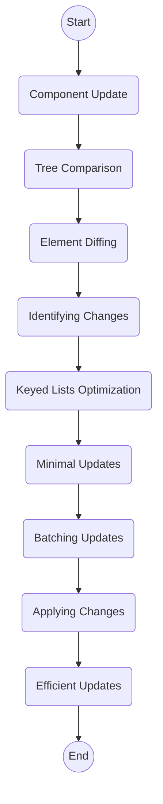

In React, reconciliation is the process of efficiently updating the UI to match the most recent state of the application. It involves comparing the newly-rendered elements with the previously-rendered ones and making the necessary changes to the DOM to reflect any updates. While reconciliation is handled by React internally and is mostly transparent to developers, understanding its underlying principles is crucial for optimizing performance and building robust applications. In this document, we'll explore the reconciliation process in React rendering, along with suitable examples and easy-to-understand points tailored for advanced React developers.

## Table of Contents
1. [Introduction to Reconciliation](#introduction-to-reconciliation)
2. [The Virtual DOM](#the-virtual-dom)
3. [Key Concepts in Reconciliation](#key-concepts-in-reconciliation)
4. [The Reconciliation Algorithm](#the-reconciliation-algorithm)
5. [Performance Optimization Techniques](#performance-optimization-techniques)
6. [Common Pitfalls and Best Practices](#common-pitfalls-and-best-practices)
7. [Conclusion](#conclusion)

## 1. Introduction to Reconciliation

Reconciliation is the process by which React determines the most efficient way to update the DOM in response to changes in the component's state or props. It ensures that the UI remains consistent with the application's data and provides a smooth and responsive user experience.

## 2. The Virtual DOM

Central to the reconciliation process is the concept of the virtual DOM. The virtual DOM is a lightweight representation of the actual DOM tree, maintained by React. It allows React to perform updates and calculations efficiently without directly manipulating the real DOM.

## 3. Key Concepts in Reconciliation

- **Component Hierarchy**: Reconciliation operates on the component hierarchy, comparing elements within the same level and their children recursively.
- **Element Diffing**: React uses a diffing algorithm to identify differences between the previous and current element trees efficiently.
- **Minimal Updates**: The goal of reconciliation is to make minimal updates to the DOM, optimizing performance and reducing unnecessary re-renders.
- **Keys**: Keys are special attributes used to uniquely identify elements in lists, allowing React to perform more efficient updates during reconciliation.

## 4. The Reconciliation Algorithm

React employs a highly optimized algorithm for reconciliation, known as the "diffing" algorithm. It involves three main steps:
1. **Tree Comparison**: React compares the previous and current element trees, identifying differences between the two.
2. **Component Updates**: React updates components based on the identified differences, applying changes to the virtual DOM.
3. **DOM Updates**: React applies the necessary updates to the real DOM, ensuring that it reflects the changes made to the virtual DOM.

## 5. Performance Optimization Techniques

To optimize performance during reconciliation, advanced React developers employ various techniques:
- **Memoization**: Memoizing components and functions to prevent unnecessary re-renders.
- **Pure Components**: Using pure components to avoid unnecessary updates when props or state haven't changed.
- **ShouldComponentUpdate**: Implementing shouldComponentUpdate lifecycle method to control when a component should re-render.

## 6. Common Pitfalls and Best Practices

- **Avoiding Inefficient Renders**: Minimizing unnecessary re-renders by optimizing component updates and using PureComponent or React.memo.
- **Proper Key Usage**: Ensuring correct and unique key usage in lists to assist React in efficiently updating elements.
- **Avoiding Nested Updates**: Preventing nested updates and side effects during the render phase to maintain predictable behavior.

## 7. Conclusion

Understanding the reconciliation process is essential for advanced React developers to build high-performance and scalable applications. By leveraging the virtual DOM, employing optimization techniques, and following best practices, developers can ensure smooth rendering and optimal user experiences in React applications.

---


Certainly! The Reconciliation Algorithm is the core mechanism in React responsible for efficiently updating the user interface (UI) to reflect changes in component state or props. It ensures that the UI remains synchronized with the application's data while minimizing unnecessary DOM manipulations. Here's a more detailed explanation of the Reconciliation Algorithm:

### 1. Tree Comparison:
   - **Element Diffing**: React performs a recursive comparison between the previous and current element trees to identify differences.
   - **Virtual DOM Representation**: React maintains a lightweight representation of the DOM known as the virtual DOM, which allows for efficient tree comparison without directly manipulating the actual DOM.
   - **Component Hierarchy**: Reconciliation operates on the component hierarchy, comparing elements within the same level and their children recursively.

### 2. Component Updates:
   - **Identifying Changes**: React identifies changes between the previous and current element trees, including additions, removals, and updates.
   - **Minimal Updates**: The goal of reconciliation is to make minimal updates to the DOM to optimize performance and reduce unnecessary re-renders.
   - **Batching Updates**: React batches multiple updates into a single render cycle, minimizing the number of DOM operations and improving performance.

### 3. DOM Updates:
   - **Applying Changes**: Once the differences between the previous and current element trees are identified, React applies the necessary updates to the real DOM.
   - **Efficient Updates**: React applies updates selectively to the DOM, only modifying elements that have changed, rather than re-rendering the entire UI.
   - **Keyed Lists Optimization**: React uses keys to optimize updates in lists by efficiently reordering, adding, or removing list items based on key matches.

### Example:
Consider a scenario where a list of items is being rendered in a React component. When an item is added to the list, the reconciliation algorithm compares the previous list with the updated list, identifies the new item, and efficiently adds it to the DOM without re-rendering the entire list.

```jsx
// Previous list
const previousList = ['Item 1', 'Item 2'];

// Updated list
const updatedList = ['Item 1', 'Item 2', 'Item 3'];

// Reconciliation algorithm efficiently adds 'Item 3' to the DOM
```

### Benefits:
- **Performance Optimization**: By minimizing DOM updates and selectively applying changes, the reconciliation algorithm improves rendering performance, resulting in faster UI updates.
- **Consistent UI**: The algorithm ensures that the UI remains synchronized with the application's data, providing a seamless and consistent user experience.
- **Developer Productivity**: Developers can focus on building features without worrying about manual DOM manipulation, as React handles updates efficiently.

### Conclusion:
The Reconciliation Algorithm is a fundamental aspect of React's rendering process, enabling efficient updates to the UI while maintaining performance and consistency. By understanding how reconciliation works, developers can optimize their React applications for better performance and user experience.

Certainly! Here's a step-by-step description of the Reconciliation Algorithm in React:

### Reconciliation Algorithm Steps:

1. **Initial Render**:
   - When a component is first rendered, React creates a virtual DOM representation of the UI based on the component hierarchy.

2. **Component Update**:
   - When a component's state or props change, React triggers a re-render of the component and its children.

3. **Tree Comparison**:
   - React compares the new virtual DOM representation with the previous one to identify differences.

4. **Element Diffing**:
   - React recursively traverses the element trees, comparing elements at each level to determine additions, removals, or updates.

5. **Identifying Changes**:
   - React identifies the specific changes between the previous and current element trees, including new elements, removed elements, and updated elements.

6. **Keyed Lists Optimization**:
   - React optimizes updates in lists by efficiently reordering, adding, or removing list items based on key matches.

7. **Minimal Updates**:
   - The goal of reconciliation is to make minimal updates to the real DOM to optimize performance and reduce unnecessary re-renders.

8. **Batching Updates**:
   - React batches multiple updates into a single render cycle to minimize the number of DOM operations and improve performance.

9. **Applying Changes**:
   - Once the differences between the previous and current element trees are identified, React applies the necessary updates to the real DOM.

10. **Efficient Updates**:
    - React applies updates selectively to the DOM, only modifying elements that have changed, rather than re-rendering the entire UI.

### Flowchart:



### Conclusion:
The Reconciliation Algorithm ensures that React efficiently updates the UI in response to changes in component state or props while minimizing the performance impact. By comparing virtual DOM representations and selectively applying changes to the real DOM, React provides a seamless and optimized user experience.